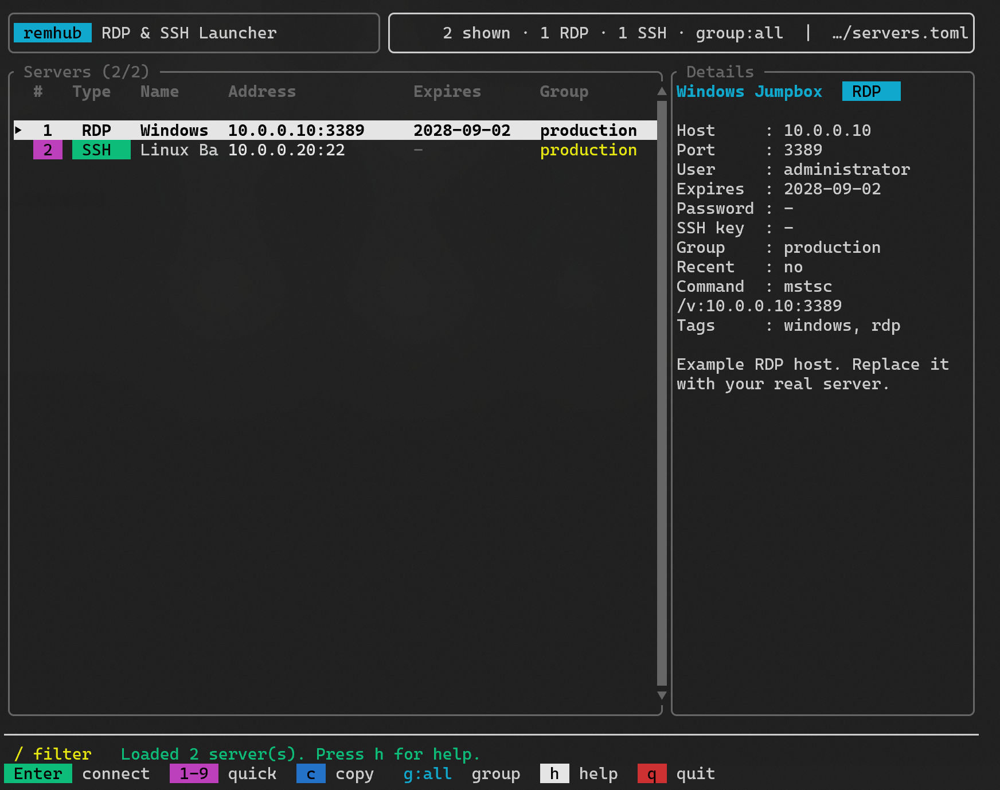

# remhub

**A terminal UI launcher for RDP and SSH servers.**

`remhub` (Remote Hub) manages your server list in `servers.toml` and lets you connect to Windows Remote Desktop (RDP) or SSH sessions with one keystroke — all from a fast keyboard-driven TUI.

English | [中文](README.zh-CN.md)

## Screenshot



## Features

- **RDP** — Launches `mstsc` with `/v:host:port`; stores credentials via `cmdkey`; also opens `.rdp` files directly
- **SSH** — Invokes the system `ssh` client; on Windows, opens in a new terminal window by default so you can manage multiple sessions
- **TUI** — Search, group filtering, details panel, recently used servers pinned to the top
- **Shortcuts** — Number keys 1–9 for quick connect; copy commands to the clipboard
- **Add, Edit & Delete** — Add or edit servers interactively inside the TUI (saved to `servers.toml`); delete with a confirmation step
- **Config** — Plain TOML configuration; an example file is generated on first run
- **Bilingual** — English (default) or Chinese UI via `lang = "zh"` in `[defaults]`

## Requirements

- [Rust](https://rustup.rs/) (stable, edition 2024)
- **RDP**: Windows + `mstsc`
- **SSH**: OpenSSH client (`ssh`); on Windows, [Windows Terminal](https://aka.ms/terminal) (`wt`) is recommended

## Quick Start

```powershell
# Clone and build
git clone https://github.com/AnxiangLemon/remhub.git
cd remhub
cargo build --release

# Create your config from the example
Copy-Item .\servers.example.toml .\servers.toml
# Edit servers.toml with your servers, then run:
.\target\release\remhub.exe
```

Development mode:

```powershell
cargo run
```

### Config file location

| Method | Example |
| --- | --- |
| Default | `servers.toml` next to `remhub.exe`; falls back to `./servers.toml` when developing with `cargo run` |
| Argument | `remhub.exe D:\configs\servers.toml` |
| Environment | `$env:REMHUB_CONFIG="D:\configs\servers.toml"` |

## Configuration

See [`servers.example.toml`](servers.example.toml) for a full example.

```toml
[defaults]
lang = "en"                     # "en" (default) or "zh" for Chinese UI
rdp_command = "mstsc"
ssh_command = "ssh"
ssh_new_window = true           # Windows default: open SSH in a new terminal tab
ssh_extra_args = ["-o", "ServerAliveInterval=30"]

[[servers]]
name = "Windows Jumpbox"
host = "10.0.0.10"
group = "production"
protocol = "rdp"
port = 3389
user = "administrator"
password = "your-rdp-password"
expires_at = "2028-09-02"
tags = ["windows", "rdp"]

[[servers]]
name = "Linux Bastion"
host = "10.0.0.20"
group = "production"
protocol = "ssh"
port = 22
user = "ops"
private_key_path = "C:\\Users\\you\\.ssh\\id_ed25519"
tags = ["linux", "ssh"]
```

### Server fields

| Field | Description |
| --- | --- |
| `name` | Display name in the TUI |
| `host` | Hostname or IP address |
| `protocol` | `rdp` or `ssh` |
| `port` | Optional port (RDP: 3389, SSH: 22) |
| `user` | Username (`user@host` for SSH; used with `password` for RDP) |
| `password` | RDP password (saved via `cmdkey`; **not** passed to SSH) |
| `private_key_path` | SSH private key file (`ssh -i`) |
| `private_key` | Inline SSH private key (written to a temp file at runtime) |
| `domain` | Windows domain for RDP (`domain\user`) |
| `expires_at` | Expiry date `YYYY-MM-DD`, shown in the server list |
| `group` | Group label for filtering and display |
| `note` | Free-text note shown in the details panel |
| `tags` | Tags for search |
| `rdp_file` | Launch a `.rdp` file instead of `/v:host` |

## Keyboard Shortcuts

| Key | Action |
| --- | --- |
| `Enter` | Connect to selected server |
| `1`–`9` | Quick connect to visible servers 1–9 |
| `c` | Copy connection command to clipboard |
| `a` | Add a new server (interactive form, saved to `servers.toml`) |
| `i` | Edit selected server (interactive form, saved to `servers.toml`) |
| `d` / `Delete` | Delete selected server (with confirmation) |
| `g` | Cycle group filter (all → group1 → …) |
| `/` | Search by name, host, group, protocol, or tags |
| `↑`/`↓` or `j`/`k` | Move selection |
| `PageUp`/`PageDown` | Jump 10 rows |
| `Home`/`End` | First / last server |
| `r` | Reload `servers.toml` |
| `h` | Help |
| `q` / `Esc` / `Ctrl+C` | Quit |

Recently connected servers (last 5) are pinned to the top on startup.

Press `h` inside the app for the full shortcut list.

## How connections work

**RDP**

```text
cmdkey /generic:TERMSRV/host /user:user /pass:password
mstsc /v:host:port
```

**SSH** (new window, default on Windows)

```text
wt new-tab --title "SSH - name" -- ssh -p port user@host
```

Set `ssh_new_window = false` in `[defaults]` to run SSH in the current terminal instead.

## Security

> **Do not commit `servers.toml` to version control.**

It typically contains real hostnames, usernames, and passwords. This repository ignores `servers.toml` by default. Use `servers.example.toml` as a template with placeholder values only.

Recent-connection history is stored locally at:

```text
%LOCALAPPDATA%\remhub\recent.toml
```

Inline SSH private keys are materialized under:

```text
%TEMP%\remhub-keys\
```

## License

[MIT](LICENSE)
